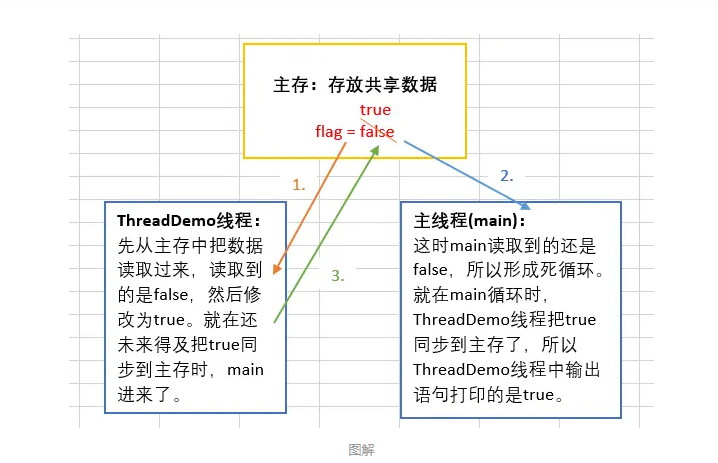
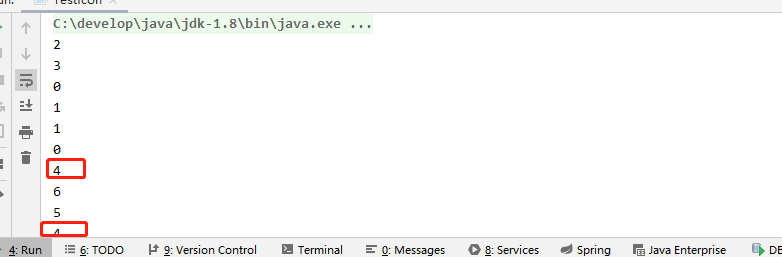

### 线程之间访问共享资源
```java
package com.yamhto.javaStudy.juc;

/**
 * @author yamhto
 * @className: TestVolatile.java
 * @package com.yamhto.javaStudy.juc
 * @description: 线程之间的可见性测试
 * @date 2020/4/2 15:33
 */
public class TestVolatile {
    public static void main(String[] args){ //这个线程是用来读取flag的值的
        ThreadDemo threadDemo = new ThreadDemo();
        Thread thread = new Thread(threadDemo);
        thread.start();
        while (true){
            if (threadDemo.isFlag()){
                System.out.println("主线程读取到的flag = " + threadDemo.isFlag());
                break;
            }
        }
    }
}

class ThreadDemo implements Runnable{ //这个线程是用来修改flag的值的
    public  boolean flag = false;
    @Override
    public void run() {
        try {
            Thread.sleep(200);
        } catch (InterruptedException e) {
            e.printStackTrace();
        }
        flag = true;
        System.out.println("ThreadDemo线程修改后的flag = " + isFlag());
    }

    public boolean isFlag() {
        return flag;
    }

    public void setFlag(boolean flag) {
        this.flag = flag;
    }
}

```


####解决方法和缺点
```text
1. 通过 synchronized 来解决，但是线程进入代码块会阻塞，效率低
2. 通过添加 volatile 来解决 ，但是无法保证原子性
```

###原子性
```java
package com.yamhto.javaStudy.juc;

/**
 * @author yamhto
 * @className: TestIcon.java
 * @package com.yamhto.javaStudy.juc
 * @description: 测试原子性
 * @date 2020/4/2 16:22
 */
public class TestIcon {
    public static void main(String[] args){
        AtomicDemo atomicDemo = new AtomicDemo();
        for (int x = 0;x < 10; x++){
            new Thread(atomicDemo).start();
        }
    }
}

class AtomicDemo implements Runnable{
    private int i = 0;
    public int getI(){
        return i++;
    }
    @Override
    public void run() {
        try {
            Thread.sleep(200);
        } catch (InterruptedException e) {
            e.printStackTrace();
        }
        System.out.println(getI());
    }
}

```

